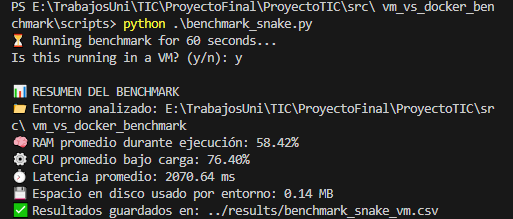
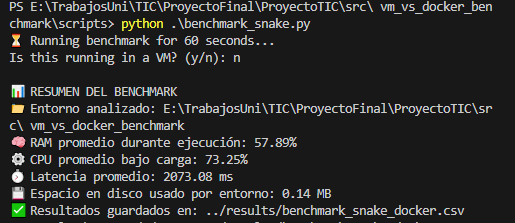
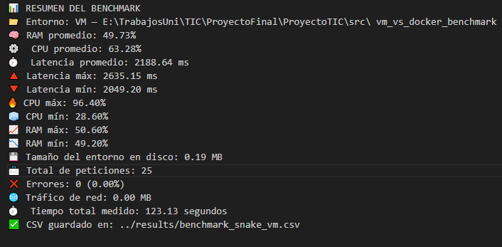
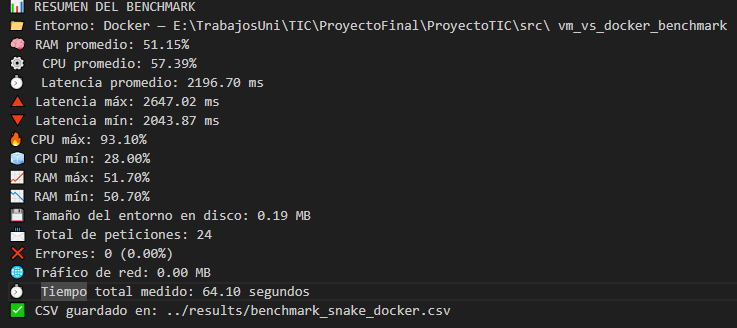
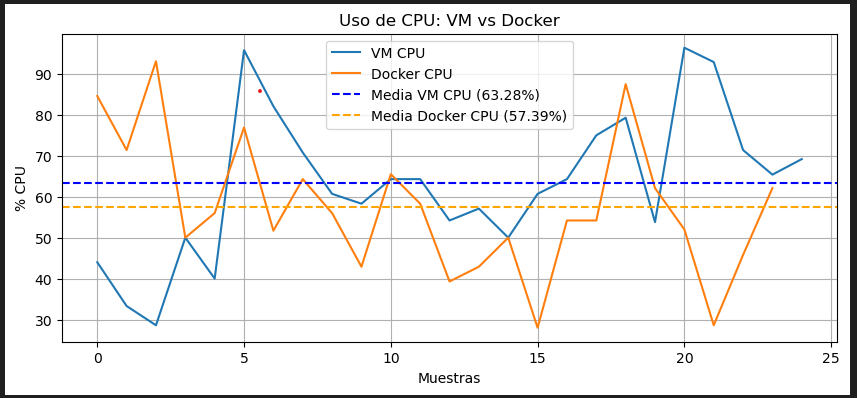
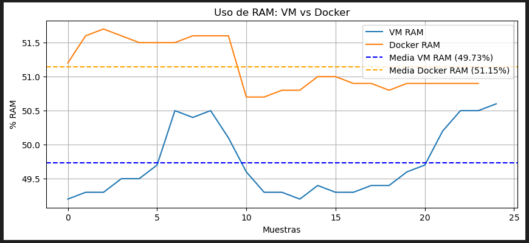
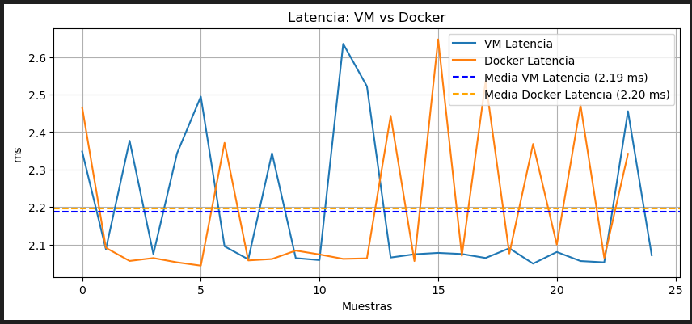

# 🐍 Proyecto de Benchmark: VM vs Docker con un servidor Snake

Este proyecto evalúa y compara el rendimiento entre una máquina virtual (VirtualBox) y un contenedor Docker ejecutando un servidor Snake desarrollado en Flask y con una interfaz web interactiva.

---

## 🖥️ ¿Qué son las máquinas virtuales y los contenedores? 🚢

Para entender las diferencias entre los entornos donde se ejecuta el servidor Snake, es fundamental conocer qué son las máquinas virtuales (VM) y los contenedores, dos tecnologías usadas ampliamente para aislar aplicaciones y facilitar su despliegue.

### 🖥️ Máquinas Virtuales (VM)

Una máquina virtual es una emulación completa de un sistema operativo que corre sobre hardware físico, gestionada por un software llamado *hipervisor* (por ejemplo, VirtualBox o VMware). Cada VM incluye su propio núcleo (kernel), sistema operativo, librerías y aplicaciones, funcionando de manera independiente del sistema operativo anfitrión.

- **Ventajas:**  
  - 🔒 Alto nivel de aislamiento y seguridad, pues cada VM es un sistema completo.  
  - 💻 Puede ejecutar sistemas operativos distintos al del host (por ejemplo, Windows host con Linux guest).  
  - ⚙️ Ideal para aplicaciones que requieren un entorno específico o un kernel modificado.

- **Desventajas:**  
  - 🐘 Consumo considerable de recursos (CPU, memoria, almacenamiento).  
  - 🕒 Inicio y parada más lentos comparados con contenedores.

### 🚢 Contenedores

Los contenedores, como los gestionados por Docker, son una forma más ligera de virtualización a nivel de sistema operativo. En lugar de virtualizar todo un sistema operativo, comparten el núcleo del host y aíslan únicamente los procesos y recursos necesarios para ejecutar la aplicación.

- **Ventajas:**  
  - ⚡ Uso eficiente de recursos, arrancan y se detienen rápidamente.  
  - 📦 Facilitan la portabilidad de aplicaciones al empaquetar dependencias y configuraciones.  
  - ☁️ Ideales para despliegues escalables y microservicios.

- **Desventajas:**  
  - 🔓 Menor aislamiento comparado con VM, ya que comparten el kernel del host.  
  - ⚠️ Limitaciones en personalización del sistema operativo o seguridad estricta.

### 🎯 Relación con el proyecto

En este proyecto se compara el rendimiento y uso de recursos de un servidor Snake corriendo en ambos entornos: una máquina virtual tradicional y un contenedor Docker. Esto permite evaluar qué opción es más eficiente y adecuada para aplicaciones web sencillas, así como entender el impacto de cada tecnología en el rendimiento y la experiencia de usuario.

---

## ⚙️ Entorno de Pruebas

- **Host**: Intel Core i3 9100F, 16 GB RAM, Windows 10
- **Virtual Machine (Guest)**: Ubuntu 20.04, 4 GB RAM, 2 vCPU, VirtualBox 7
- **Docker**: Imagen base `python:3.10-slim`, 2 CPUs asignadas
- **Red y conexión**: Ambas plataformas usan red NAT para conectarse al host.
El servidor Flask se expone en localhost:5000 para acceder desde el navegador

---

## 📁 Estructura actual del proyecto

```cpp
.
├── LICENSE
├── README.md
├── install.ipynb
├── enunciadoProyecto.md
├── requirements.txt
├── .gitignore
├── notebooks/
│   ├── vm_vs_docker_comparison.ipynb
│   ├── vm_vs_docker_comparison_cpu.png
│   ├── vm_vs_docker_comparison_latency.png
│   ├── vm_vs_docker_comparison_ram.png
├── results/
│   ├── benchmark_snake_docker.csv
│   ├── benchmark_snake_docker.txt
│   ├── benchmark_snake_vm.csv
│   ├── benchmark_snake_vm.txt
│   ├── benchmark_docker_14_05.png
│   ├── benchmark_docker_15_05.png
│   ├── benchmark_vm_14_05.png
│   ├── benchmark_vm_15_05.png
├── scripts/
│   ├── benchmark_snake.py
│   ├── docker_setup.sh
│   ├── vm_setup.sh
│   ├── Dockerfile
│   └── web_snake_game/
│       ├── run_snake_server.py
│       ├── templates/
│       │   └── snake.html
│       └── static/
│           └── snake.js
```

---

## 📚 Bibliografía y Recursos

A continuación, se presentan las principales herramientas, librerías y recursos que se han utilizado y consultado para el desarrollo y ejecución de este proyecto:

### 🛠️ Herramientas y Plataformas

- **Python 3.8+**  
  Lenguaje de programación principal para el servidor y scripts.  
  Instalación oficial: [python.org](https://www.python.org/downloads/)

- **Flask**  
  Microframework web en Python para crear el servidor Snake.  
  Documentación: [flask.palletsprojects.com](https://flask.palletsprojects.com/)

- **Docker**  
  Plataforma para contenedores que permite empaquetar aplicaciones con sus dependencias.  
  Documentación e instalación: [docs.docker.com](https://docs.docker.com/get-docker/)

- **VirtualBox**  
  Software para crear y manejar máquinas virtuales.  
  Documentación e instalación: [virtualbox.org](https://www.virtualbox.org/wiki/Downloads)

- **Jupyter Notebook**  
  Entorno interactivo para análisis y visualización de datos con Python.  
  Instalación: `pip install notebook`  
  Documentación: [jupyter.org](https://jupyter.org/)

---

## ⚙️ Requisitos

```bash
Python 3.8+

Docker

VirtualBox (con Linux guest si aplica)

pip
```

---

## ✅ Librerías necesarias

El proyecto utiliza las siguientes librerías de Python:

``` bash
flask
requests
psutil
pandas
matplotlib
jupyter
```

---

## 📦 Instalación de dependencias

Desde la raíz del proyecto:

``` bash
pip install -r requirements.txt
```

---

## 🧪 Automatización del entorno VM

Puedes usar los siguientes scripts para automatizar la instalación del entorno:

```bash
cd scripts
bash vm_setup.sh         # Configuración para VM
bash docker_setup.sh     # Configuración para Docker
```

---

## 🚀 Ejecutar el servidor Snake

Para iniciar el servidor Snake con interfaz web:

```bash
cd scripts/web_snake_game
python run_snake_server.py
```

Esto abrirá un servidor Flask en http://localhost:5000/. Podrás acceder a la interfaz del juego desde un navegador en esa dirección.

---

## 🎮 Jugar Snake

Visita:

``` arduino
http://localhost:5000/play
```

Ahí podrás jugar una versión del juego Snake directamente desde el navegador despues de ejecutarlo en la terminal.

---

## 📊 Benchmark y Análisis de Resultados

- Ejecutar Benchmarks

Asegúrate de que el servidor Snake esté corriendo. Luego, desde una nueva terminal:

```bash
cd scripts
python benchmark_snake.py
```

Este script realiza:

- 📈 Medición del uso de CPU y RAM

- ⏱ Tiempo de respuesta de la aplicación

Los resultados se guardan en:

`results/benchmark_snake_vm.csv` (si se corre en una VM)

`results/benchmark_snake_docker.csv` (si se corre en Docker)

- Visualizar resultados
  
Abre el notebook:

```bash
cd notebooks
jupyter notebook vm_vs_docker_comparison.ipynb
```

El notebook permite analizar los resultados con gráficos y estadísticas.

---

### 📐 Métricas Medidas

El script `benchmark_snake.py` mide las siguientes métricas:

- **Uso de CPU (%)**: mediante `psutil`
- **Uso de RAM (%)**: mediante `psutil`
- **Latencia (ms)**: usando `requests` con timestamps
- **Frecuencia de respuesta**: número de respuestas por segundo

**Métricas no implementadas (fuera del alcance del proyecto):**

- Tiempo de arranque del entorno
- Rendimiento de red o disco

---


## 🗃️ Carpeta results/

Contiene los archivos CSV generados por los benchmarks. Cada archivo incluye:

- Latencia

- Porcentaje de uso de CPU

- Porcentaje de uso de memoria RAM

---

## 📁 Estructura de los Resultados / Análisis

Este proyecto compara el rendimiento de una misma carga de trabajo (`benchmark_snake`) ejecutada tanto en una máquina virtual (VM) como en un contenedor Docker.

```cpp
├── results/
│ ├── benchmark_snake_vm.csv
│ └── benchmark_snake_docker.csv
│ └── benchmark_docker.png
│ └── benchmark_vm.png
├── notebooks/
│ └── vm_vs_docker_comparison.ipynb
│   ├── vm_vs_docker_comparison_cpu.png
│   ├── vm_vs_docker_comparison_latency.png
│   ├── vm_vs_docker_comparison_ram.png
```

- `results/`: contiene los archivos CSV con los resultados de los benchmarks.
- `notebooks/`: incluye notebooks de análisis y gráficos comparativos.

---

## 📊 Comparativa de Rendimiento: VM vs Docker

Se ejecutó un benchmark de 60 segundos sobre un juego Snake en Flask, midiendo el rendimiento del entorno bajo carga desde dos contextos distintos:

### 📅 Resultados del 14/05

| 🖥️ Virtual Machine 14/05 | 🐳 Docker 14/05 |
|--------------------------|------------------|
|  |  |

🔎 **Observaciones 14/05**:

- Ambos entornos muestran un rendimiento muy similar.
- Docker presenta una ligera ventaja en el uso de CPU.
- La VM tiene una mayor variabilidad en consumo.

---

### 📅 Resultados del 15/05

| 🖥️ Virtual Machine 15/05 | 🐳 Docker 15/05 |
|---------------------------|-----------------|
|  |  |

🔎 **Observaciones 15/05**:

- Docker mantiene un comportamiento más estable en consumo de CPU y RAM.
- La VM sigue siendo más pesada en carga aunque mejora respecto a la prueba del 14/05.
- Latencias más consistentes en Docker.

## 📈 Análisis Comparativo: 14/05 vs 15/05

### 🗓️ Día 14/05

- **Rendimiento general:** Ambos entornos (VM y Docker) muestran un rendimiento muy similar bajo carga.
- **CPU:** Docker presentó una **ligera ventaja** en el uso de CPU, utilizando menos porcentaje que la VM.
- **Latencia:** La VM mostró una **mayor variabilidad** en los tiempos de respuesta.
- **Estabilidad:** Docker se comportó de forma más uniforme, mientras que la VM fue algo más inestable en recursos.
- **Consumo de RAM:** Prácticamente iguales, con menos de 1% de diferencia.

### 🗓️ Día 15/05

- **Estabilidad:** Docker mantuvo un **comportamiento más estable** tanto en consumo de CPU como de RAM.
- **Consumo de recursos:** La VM sigue siendo **más pesada en carga**, aunque mejoró respecto al día anterior.
- **Latencias:** Docker mostró **latencias más consistentes**, mientras que la VM aún presentó cierta variación.
- **Tendencias:** Se confirma que Docker, aunque más ligero, mantiene resultados estables y predecibles.

### ✅ Conclusiones Comparativas

- Docker destaca por su **estabilidad y eficiencia ligera**, tanto el 14 como el 15 de mayo.
- La VM, aunque funcional, presenta **más oscilaciones en rendimiento** y un **mayor consumo de CPU**.
- La diferencia entre días resalta una **mejora en la VM**, pero Docker sigue liderando en consistencia.
- Para entornos de despliegue donde la predictibilidad y estabilidad son clave, Docker ofrece una **ventaja clara**.

## 📓 Análisis en notebooks

En el notebook `notebooks/vm_vs_docker_comparison.ipynb` se realiza una comparación del uso de CPU, RAM y LATENCY entre la ejecución en VM y en Docker.

A partir de los datos de `results/`, se genera la siguiente gráfica:

<p align="center">
  
</p>
<p align="center">
  
</p>
<p align="center">
  
</p>


## 🔍 Interpretación


- **VM CPU** (línea azul): presenta una mayor variabilidad y consumo promedio más alto de CPU.
- **Docker CPU** (línea naranja): es más eficiente, con menor uso de CPU bajo la misma carga.

Esto indica que **Docker es más liviano** para esta tarea, reduciendo el uso de recursos del sistema en comparación con una VM tradicional. Sin embargo, los resultados pueden variar según el contexto y carga específica.

---

## 🔒 Aislamiento y Seguridad en este Proyecto

En el contexto de este proyecto, el aislamiento se evaluó al ejecutar un mismo servidor Snake en dos entornos:

- Máquina Virtual (VM)

  - El servidor Flask corre sobre un sistema operativo Linux completo (VirtualBox).

  - Ofrece un mayor nivel de aislamiento, ya que la VM tiene su propio kernel, sistema de archivos, usuarios y procesos.

  - Ideal para pruebas que requieren emular un entorno más realista o separado completamente del host.

  - Consumo de recursos más alto por la sobrecarga de virtualización completa.

- Contenedor Docker

  - El mismo servidor Flask se ejecuta como contenedor liviano.

  - Comparte el kernel del sistema host, lo cual reduce el nivel de aislamiento.

  - Es más eficiente en consumo de CPU y RAM, lo que lo hace excelente para entornos de desarrollo y despliegue rápido.

  - Aunque comparte más con el host, se pueden usar medidas como AppArmor o seccomp para mitigar riesgos de seguridad.

Conclusión:

- Para este proyecto de benchmark, Docker ofrece una ejecución más rápida y eficiente del servidor Snake, aunque con menor aislamiento.

- La VM proporciona un entorno más controlado y aislado, lo cual es útil en pruebas de compatibilidad y simulación de entornos reales.

- La elección entre uno u otro dependerá del objetivo: rapidez y eficiencia (Docker) o aislamiento total y robustez (VM).

---

### ✅ Logros del proyecto

- [x] Juego Snake funcional con Flask
- [x] Automatización en VM y Docker
- [x] Benchmark comparativo con gráficos
- [x] Análisis visual en notebooks

---

#### 📄 Licencia  

Este proyecto está bajo la licencia MIT. Consulta el archivo LICENSE para más detalles.
